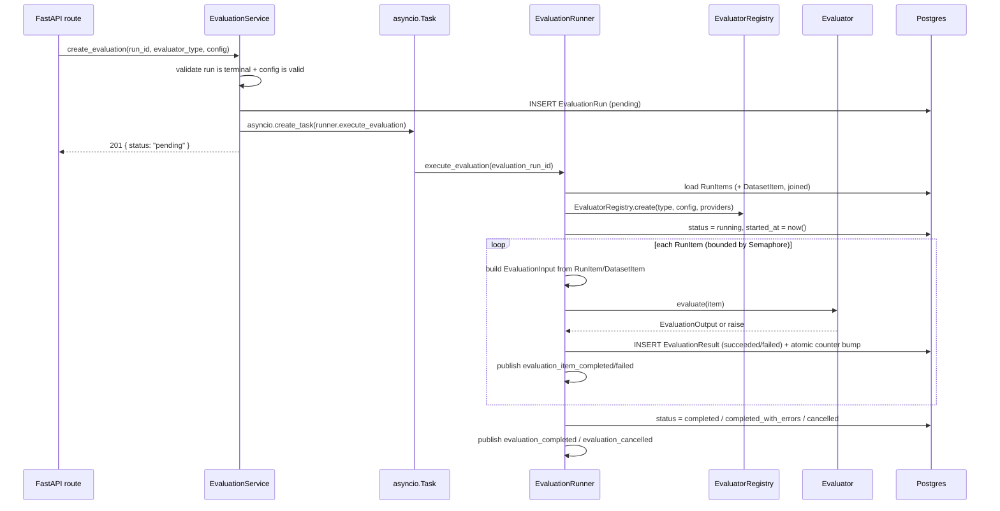
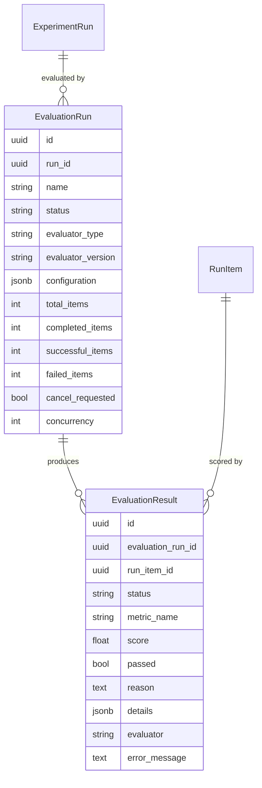

# Evaluation Engine (Phase 4)

This document describes the evaluation engine: scoring a completed
`ExperimentRun`'s `RunItem`s against a dataset's expected outputs, with
multiple pluggable evaluation strategies, aggregate metrics, and
regression detection between runs. For how generation itself works, see
[`experiments.md`](./experiments.md) — evaluation is a separate,
additive layer on top of it, not a replacement.

## The pipeline

```
ExperimentRun
  ↓
EvaluationRun
  ↓
EvaluationRunner
  ↓
EvaluatorRegistry
  ↓
Evaluator
  ↓
EvaluationResult
  ↓
Aggregate Metrics
  ↓
Comparison / Regression Detection
```

An **EvaluationRun** means "evaluate this completed `ExperimentRun`
using this evaluator configuration." Creating one validates the target
run has finished and the configuration is valid, then the
**EvaluationRunner** iterates its `RunItem`s, hands each one to an
**Evaluator**, and persists one **EvaluationResult** per item, the same
"every item gets a record regardless of outcome" discipline
`ExperimentRunner` uses for `RunItem`s.

**The evaluation layer never touches generation.** `RunItem` gains no
`score` column; a `RunItem` can be scored by many `EvaluationRun`s
(different evaluators, or the same evaluator re-run after a threshold
change) without re-running the experiment.

## Architecture: framework-agnostic evaluators

`packages/evaluation` (`reliability_lab_evaluation`) mirrors
`packages/llm`'s shape: no FastAPI, no SQLAlchemy, no Ollama. It knows
nothing about `RunItem`s or the database — `apps/api/app/evaluation/`
(the runner, persistence, API routes) is the only thing that wires it
into the rest of the application.

```
packages/evaluation/src/reliability_lab_evaluation/
  base.py            Evaluator (ABC): evaluate(item) -> EvaluationOutput
  types.py           EvaluationInput, EvaluationOutput, EvaluatorMetadata
  registry.py        EvaluatorRegistry — name -> Evaluator class, config validation
  exceptions.py      EvaluationConfigError, EvaluatorExecutionError
  metrics.py         calculate_aggregate_metrics() — pure function over ResultRecords
  regression.py      detect_regression() — pure function, baseline vs. candidate
  embeddings/
    base.py            EmbeddingProvider (ABC): embed / embed_batch
    sentence_transformer.py  SentenceTransformerEmbeddingProvider (lazy-imported)
  evaluators/
    exact_match.py
    contains.py
    semantic_similarity.py
    llm_judge.py
    judge_prompt.py    builds the judge's prompt + response JSON Schema
```

An `Evaluator` is constructed once per `EvaluationRun` — not once per
item — so it can hold per-run state (`SemanticSimilarityEvaluator`'s
embedding cache) and is reused across every item in that run.
`EvaluationInput` is built entirely by the runner and contains
everything an evaluator needs: `input`, `expected_output`,
`actual_output`/`actual_structured_output`, `metadata`, `model`,
`experiment_name`, `run_id`. Evaluators never query a database, which is
what makes them deterministic and testable with plain Python values.

```python
class Evaluator(ABC):
    metadata: ClassVar[EvaluatorMetadata]      # name, version, description, score_range, ...
    config_model: ClassVar[type[BaseModel]]    # validates configuration — no eval()/exec()

    async def evaluate(self, item: EvaluationInput) -> EvaluationOutput:
        ...
```

`EvaluationOutput` is `score: float | None`, `passed: bool | None`,
`reason: str | None`, `details: dict` — every field optional because not
every evaluator produces a score, and no evaluator ever fabricates one
to fill the gap.

## Evaluator registry

`EvaluatorRegistry` is a name → `Evaluator` class lookup, not an
`if/elif` chain. Adding a new evaluator means writing a new `Evaluator`
subclass, decorating it with `@EvaluatorRegistry.register`, and nothing
in the runner or the API routes changes.

```python
@EvaluatorRegistry.register
class MyEvaluator(Evaluator):
    metadata = EvaluatorMetadata(name="my_evaluator", version="v1", ...)
    config_model = MyConfig
    async def evaluate(self, item): ...
```

`EvaluatorRegistry.validate_config(name, config)` validates
configuration against `config_model` *without* instantiating the
evaluator (no `EmbeddingProvider`/`LLMProvider` needed) — this is what
lets `POST /api/v1/evaluations` reject bad configuration with a 422
before an `EvaluationRun` row is ever created, the same "fail fast, no
orphaned row" pattern `ExperimentService` uses for prompt templates.
`EvaluatorRegistry.list_metadata()` returns every evaluator's metadata
with `config_schema` filled in from `config_model.model_json_schema()`
— this is what `GET /api/v1/evaluators` exposes so the frontend
discovers evaluator capabilities instead of hard-coding them.

Configuration is validated exclusively through Pydantic model
validation — there is no code path that executes evaluator
configuration as an expression.

## The four built-in evaluators

| Evaluator | Score | Needs |
|---|---|---|
| `exact_match` | 1.0 / 0.0 | nothing |
| `contains` | matched / required terms | nothing |
| `semantic_similarity` | cosine similarity | `EmbeddingProvider` |
| `llm_judge` | judge score / scale | `LLMProvider` |

### `exact_match`

Compares `expected_output` and `actual_output` after safe, configurable
normalization: trim whitespace, normalize line endings, optional case
folding (`case_sensitive`, `ignore_whitespace`). Deliberately does not
collapse internal whitespace or otherwise rewrite the text being
compared.

### `contains`

Partial credit: `score = matched_terms / len(required_terms)` against a
configured list of required phrases, with a `threshold` for pass/fail
and case sensitivity configurable. `details` records which terms
matched and which didn't, so a failure is inspectable, not just a number.

### `semantic_similarity`

```
SemanticSimilarityEvaluator
        ↓
EmbeddingProvider
        ↓
Local embedding model
```

Embeds `expected_output` and `actual_output` via an injected
`EmbeddingProvider` and scores their cosine similarity against a
configurable `threshold`. Depends only on the `EmbeddingProvider`
abstraction — never on `sentence-transformers` directly — so
`packages/evaluation`'s own tests exercise it with a fake, no model
download required.

**Embedding architecture.** `EmbeddingProvider` (`embed`/`embed_batch`)
mirrors `LLMProvider`'s shape. `SentenceTransformerEmbeddingProvider` is
the real implementation: no paid/remote embedding API anywhere in this
evaluator, a small CPU-friendly default model
(`sentence-transformers/all-MiniLM-L6-v2`), and it lazily imports
`sentence_transformers` — inside the model-load call, run off the event
loop via `run_in_executor` — rather than at module import time. That's
what lets `reliability_lab_evaluation` (whose `__init__.py` imports
every evaluator, including this one) be imported without
`sentence-transformers` installed at all; only real usage needs the
optional `[embeddings]` extra. Configured via `Settings.embedding_model`
/ `embedding_device` / `embedding_batch_size`, wired through
`app/embeddings/dependencies.py` exactly like `app/llm/dependencies.py`
wires `OllamaProvider`.

**Embedding caching and batching.** One `Evaluator` instance is
constructed per `EvaluationRun` and reused across every item in that
run, so `SemanticSimilarityEvaluator`'s instance-level cache
(`text -> vector`) means an `expected_output` shared by many items — or
an `actual_output` repeated by a deterministic model — is only ever
embedded once per run. Uncached texts for a single item are embedded
together in one `embed_batch()` call rather than one at a time.

### `llm_judge`

```
LLMJudgeEvaluator
        ↓
LLMProvider
        ↓
OllamaProvider
        ↓
Ollama
```

Grades a candidate answer through `LLMProvider.generate_structured()` —
never Ollama directly, exactly like `GenerationService` does for the
experiment side. Configuration:

```json
{
  "judge_model": "qwen3",
  "score_scale": 5,
  "threshold": 0.7,
  "criteria": ["accuracy", "relevance", "completeness"],
  "judge_system_prompt": null,
  "judge_temperature": 0.0
}
```

**Judge isolation.** `judge_model` is always a separate, explicit
configuration field — never inherited from the `RunItem`'s own `model`
or the experiment's generation config. The evaluation creation UI keeps
"candidate model" (shown from the run being evaluated) and "judge model"
(a field the user fills in) visually distinct for the same reason.

**Structured, validated output.** The judge is asked for a JSON object
matching a schema built from `criteria`/`score_scale`
(`judge_prompt.build_response_schema`) and given the question, the
reference answer (if any), the candidate answer, and the criteria to
grade against (`judge_prompt.build_judge_messages`). The response is
validated against that schema a *second* time inside the evaluator
itself — not just trusted from the provider — via `jsonschema.validate`,
so a `FakeLLMProvider`-based test can simulate a well-formed-but-wrong-
shaped judge response. Invalid JSON, a schema mismatch, or a provider
failure all raise `EvaluatorExecutionError` with diagnostic details
preserved (the raw response, truncated) — the runner turns that into a
single failed `EvaluationResult`, never a crashed evaluation run.

**Usage tracking.** `details.usage` records `input_tokens`/
`output_tokens`/`total_tokens` and `details.latency_ms` records the
judge call's latency — judging costs resources too, and that cost is
never hidden.

The raw judge score (0..`score_scale`) is normalized to `score / score_scale`
(0..1) so every built-in evaluator's score lives on the same [0, 1]
scale — this is what makes cross-evaluator aggregate metrics and score
distributions meaningful.

## The evaluation runner

`EvaluationRunner` (`app/evaluation/runner.py`) is deliberately shaped
like `ExperimentRunner`: a plain constructor (no FastAPI dependency), a
session factory rather than a request-scoped session, bounded
concurrency, per-item failure isolation, cooperative cancellation, and
SSE progress via an in-process event bus.



### Concurrency

`app/evaluation/concurrency.py`: default 3, hard ceiling 10 — the same
default/ceiling `ExperimentRunner` uses, kept as its own module since an
`EvaluationRun`'s concurrency bounds parallel embedding/judge calls, a
different resource than parallel generation calls.

### Partial failure handling

A single item's evaluator failure never aborts the run. Every exception
an evaluator can raise (`EvaluatorExecutionError`, a timeout via
`asyncio.wait_for`, or anything unexpected) is caught and turned into a
failed `EvaluationResult` — `error_message` and (for
`EvaluatorExecutionError`) `details` preserved — while every other item
is still attempted: `100 RunItems, 95 succeed, 5 fail` →
`completed_with_errors`, never `failed`. `failed` is reserved for the
evaluation itself not being able to run at all (its `ExperimentRun`
vanished mid-flight).

A `RunItem` with no `expected_output` (its `DatasetItem` was deleted, or
never had one) or no `actual_output` (the generation itself failed) is
not a runner-level failure either — it's handed to the evaluator like
any other item, and each evaluator decides how to score it (`exact_match`/
`semantic_similarity` report `score=None`/`passed=None`; `contains`/
`llm_judge` score it like empty input).

### Cancellation

`POST /api/v1/evaluations/{id}/cancel` sets `cancel_requested = true`
and returns immediately, the same semantics as run cancellation: the
runner checks the flag before each item, no new item is evaluated once
set, but any item already past that check finishes. Skipped items still
get an `EvaluationResult` with `status = cancelled`, so completed
results are never lost.

### Progress streaming

`GET /api/v1/evaluations/{id}/events` (SSE) streams
`evaluation_started`, `evaluation_progress`, `evaluation_item_completed`,
`evaluation_item_failed`, `evaluation_completed`, and
`evaluation_cancelled`, built from curated `EvaluationRun` fields.
`app/evaluation/events.py` reuses `app.experiments.events.RunEventBus`
as-is (it's already generic over "some id → subscribers") rather than
reimplementing an identical in-process pub/sub bus — a second
process-wide singleton scoped to evaluation run ids.

### Empty runs

An `ExperimentRun` with zero `RunItem`s completes the `EvaluationRun`
immediately (`pending -> completed`, a transition
`app/evaluation/lifecycle.py` allows specifically for this case) rather
than starting a run that would never produce a single item event.

## Aggregate metrics

`calculate_aggregate_metrics()` (`reliability_lab_evaluation.metrics`) is
a pure function over plain `ResultRecord`s (`status`, `score`, `passed`)
— no SQLAlchemy, testable without a database:

```
total          every EvaluationResult, regardless of outcome
evaluated      results that completed with a non-null score
failed         results whose evaluator raised (a real failure, not a low score)
passed         count of passed=true, or None if this metric never produces pass/fail
pass_rate      passed / (results with a non-null passed)
mean/median/min/max_score
distribution   10 equal-width buckets over [0, 1] (every built-in evaluator
               normalizes its score to that range)
```

`distribution`/`mean`/`median` are only computed when at least one
result has a score — an evaluator that never produces one, or a run
with no successes yet, reports `None` rather than a misleading `0`.
`GET /api/v1/evaluations/{id}/metrics` computes this on demand from
`EvaluationResult` rows; nothing is denormalized onto `EvaluationRun`.

## Comparison and regression detection

```
GET /api/v1/evaluations/compare?baseline_id=&candidate_id=&regression_threshold=
```

Pairs two `EvaluationRun`s' results by the `RunItem.dataset_item_id`
they scored — the same idea the Phase 3 run-compare page uses for
`RunItem`s, moved server-side (`evaluation_comparison_service.py`) so
regression detection has one source of truth. Rejects comparing
evaluations that used different evaluator types (their scores aren't on
the same scale). `detect_regression()`
(`reliability_lab_evaluation.regression`) is a small, explicit
engineering comparison — **not a statistical significance test**:

```python
def detect_regression(baseline_score, candidate_score, *, threshold=0.05, higher_is_better=True):
    difference = candidate_score - baseline_score
    regression_detected = (difference if higher_is_better else -difference) < -threshold
    ...
```

A regression is flagged when the candidate is worse than the baseline
by more than `threshold` (absolute score units, default 0.05) — both
the absolute and relative difference are reported so the API/UI can
show either. The threshold comparison includes a small floating-point
tolerance so, e.g., a baseline/candidate pair exactly `0.05` apart isn't
spuriously flagged by IEEE 754 subtraction error.

## Reproducibility and versioning

An `EvaluationRun` stores everything needed to know exactly how it was
configured: `evaluator_type`, `evaluator_version` (`EvaluatorRegistry`'s
`metadata.version` at creation time — `exact_match:v1`,
`semantic_similarity:v1`, ...), the full validated `configuration`
(thresholds, judge model, criteria, embedding settings all live inside
it), `concurrency`, and timestamps. `EvaluationResult.evaluator` stores
`"<type>:<version>"` directly on the row, so a single result is
interpretable without joining back to its `EvaluationRun`. Versioning is
deliberately simple — a string bumped by hand when an evaluator's
scoring behavior changes in a way that would make old and new results
not directly comparable — not a general migration system.

## Data model



Key decisions:

- **`EvaluationRun.run_id` and `EvaluationResult.run_item_id`/
  `evaluation_run_id` are all `ON DELETE CASCADE`.** An `EvaluationRun`
  only means something relative to the `ExperimentRun` (and its
  `RunItem`s) it evaluated; if the `ExperimentRun` is deleted its
  `RunItem`s cascade away too (Phase 3's own cascade), so any
  `EvaluationResult` referencing them would be meaningless.
- **`EvaluationResult.details` is JSONB with no shared shape across
  evaluators.** `semantic_similarity` stores `similarity`/`threshold`;
  `llm_judge` stores per-criterion scores and usage; `contains` stores
  matched/missing terms. Forcing one shared structure would mean either
  a wide sparse schema or throwing away evaluator-specific context.
- **`EvaluationResult.status`/`error_message` aren't in the "obvious"
  field list** (score/passed/reason/details/evaluator) but exist for
  partial-failure handling — a failed result still needs a durable
  record distinct from a real (possibly zero) score.
- **Status columns are `VARCHAR` + `CHECK`, not native Postgres
  `ENUM`s**, matching Phase 3's `app/models/enums.py` convention.

Full detail: [`apps/api/app/models/evaluation.py`](../apps/api/app/models/evaluation.py)
and the [Alembic migrations](../apps/api/alembic/versions/).

## API

```
GET  /api/v1/evaluators                     registered evaluator metadata
POST /api/v1/evaluations                    start an evaluation run
GET  /api/v1/evaluations                    list (optional ?run_id=)
GET  /api/v1/evaluations/{id}               detail
GET  /api/v1/evaluations/{id}/results       paginated results (enriched with
                                             the RunItem/DatasetItem context scored)
GET  /api/v1/evaluations/{id}/metrics       aggregate metrics
POST /api/v1/evaluations/{id}/cancel        request cancellation
GET  /api/v1/evaluations/{id}/events        live progress (SSE)
GET  /api/v1/evaluations/compare            baseline vs. candidate + regression
```

## Frontend

```
/evaluations             list every evaluation run, with mean score/pass rate
/evaluations/new         pick a completed run, an evaluator, configure it, start
/evaluations/[id]        live progress, aggregate metrics, results table, result detail
/evaluations/compare     baseline vs. candidate scores, regression banner, per-item deltas
```

`EvaluatorConfigFields` renders per-evaluator-type configuration
(exact match's toggles, contains' term list, semantic similarity's
threshold, LLM judge's model/scale/criteria) rather than generating a
generic form from `config_schema` — the schema is still what the
backend validates against and what `GET /api/v1/evaluators` exposes,
but a handful of purpose-built fields reads better than a generic
JSON-Schema form for a form this small.

## Testing

- **Evaluator unit tests** (`test_evaluators_basic.py`,
  `test_semantic_similarity.py`, `test_llm_judge.py`): normalization and
  partial-scoring behavior, the registry's create/validate_config/
  list_metadata surface, cosine similarity edge cases, the embedding
  cache/batching, and every judge failure mode (invalid JSON, a
  schema-mismatched-but-valid response, a provider failure) — all
  against `FakeEmbeddingProvider`/`FakeLLMProvider`, no model download,
  no live Ollama.
- **Metrics/regression unit tests** (`test_evaluation_metrics.py`,
  `test_regression.py`): pure-function coverage, including the
  floating-point boundary case at the regression threshold.
- **Runner integration tests** (`test_evaluation_runner.py`): a
  `FlakyEvaluator` test double (registered once, at import time, the
  same idea as `ScriptedLLMProvider`) scripts success/failure/hang per
  item to exercise concurrency, partial failure, cancellation, timeouts,
  and empty runs against the real `EvaluationRunner`.
- **API tests** (`test_evaluations_api.py`,
  `test_evaluation_comparison_api.py`, `test_evaluation_events_api.py`):
  request/response shape, validation (a still-running run, an unknown
  evaluator, invalid configuration), and SSE plumbing, with background
  execution stubbed out.
- **Full-stack integration test** (`test_evaluation_integration.py`):
  Dataset → Experiment → Experiment Run → Evaluation → Evaluation
  Results → Aggregate Metrics, driven entirely through the HTTP API with
  both `ExperimentRunner` and `EvaluationRunner`'s background tasks
  running for real against the test database.
- **Frontend tests**: the evaluations list, dynamic evaluator
  configuration, the creation flow, the detail page (including opening
  a result's detail sheet), and the comparison page's regression
  banners.

## Known limitations

- The evaluations list page fetches aggregate metrics for each row with
  a handful of parallel requests rather than a dedicated
  list-with-metrics endpoint — reasonable for a local lab's evaluation
  list; worth revisiting if that list grows into the hundreds.
- `EvaluatorConfigFields` is hand-written per evaluator type rather than
  generated from `config_schema` — adding a fifth evaluator means adding
  a case there too, not just a backend module.
- Like the experiment engine, the in-process event bus and background
  task registry are single-process — restarting the API mid-evaluation
  loses the ability to stream further progress (the evaluation itself
  keeps executing and its final state is still correctly persisted).
- Regression detection compares two evaluations' **mean scores** only;
  it doesn't (and doesn't claim to) do any per-metric statistical
  testing beyond that single, transparent threshold comparison.
- Aggregate metrics and comparison load every `EvaluationResult` for the
  run(s) involved into memory in one query (never N+1 — a single
  `SELECT`, same as `ExperimentRunner` loading a dataset's items) rather
  than computing aggregates in the database. Fine at the scale this
  phase targets; an evaluation with hundreds of thousands of items would
  want a `SELECT avg(score), ...`-style query instead.
