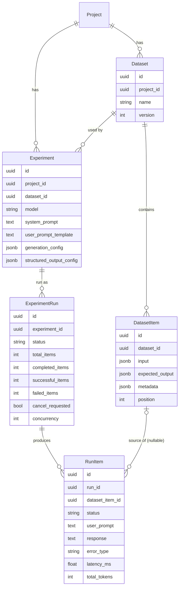
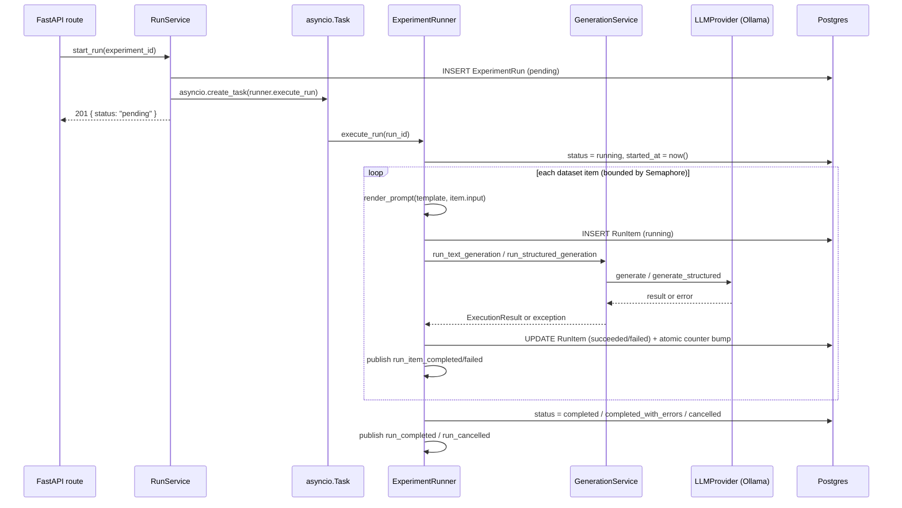
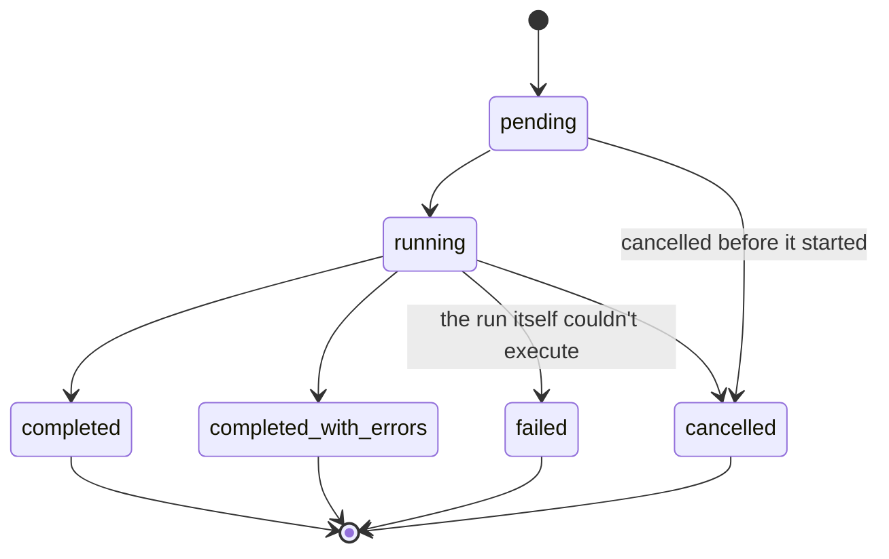

# Experiment Engine (Phase 3)

This document describes the experiment engine: reproducible dataset-driven
LLM runs, from configuration through execution to inspection and
comparison. For how a single generation call flows through the LLM
provider abstraction, see [`llm-execution.md`](./llm-execution.md) — the
runner described here is a caller of that same layer, not a
replacement for it.

## The pipeline

```
Dataset
  ↓
Experiment
  ↓
Run
  ↓
Runner
  ↓
GenerationService
  ↓
LLMProvider
  ↓
Ollama
  ↓
RunItem
```

A **Dataset** is a versioned collection of items to run against. An
**Experiment** is a reproducible configuration (dataset + model + prompts
+ generation parameters) — creating one doesn't run anything. A **Run**
is one execution of an experiment: the `ExperimentRunner` iterates the
dataset, calls the same `GenerationService` the Playground uses, and
persists one **RunItem** per dataset item, regardless of outcome.

## Data model



Key decisions:

- **`DatasetItem.input`/`expected_output` are JSONB, not text.** A dataset
  item can be a plain string question or a structured object (e.g. RAG
  context + question) — the schema doesn't force a shape. `metadata` is
  mapped under the Python name `item_metadata` (`metadata` is reserved on
  declarative SQLAlchemy models).
- **`Experiment` snapshots nothing itself — `ExperimentRun` does.**
  `ExperimentRun.model`/`generation_config` are copied from the experiment
  at start time, so editing an experiment later never changes the meaning
  of a past run.
- **`RunItem.dataset_item_id` is `ON DELETE SET NULL`, not `CASCADE`.** A
  `RunItem` carries its own copy of the rendered prompt and response, so
  it stays fully inspectable even after the source dataset item is
  edited or deleted — only the link is cleared.
- **`Experiment.dataset_id` has no cascade delete.** A dataset in use by
  an experiment can't be dropped out from under it; `DatasetService`
  checks this up front for a friendly error, backed by the FK as a
  safety net.
- **Status columns are `VARCHAR` + `CHECK`, not native Postgres `ENUM`s**
  (`app/models/enums.py`). Adding a status value later is a one-line
  migration instead of a non-transactional `ALTER TYPE ... ADD VALUE`.

Full detail: [`apps/api/app/models/dataset.py`](../apps/api/app/models/dataset.py),
[`experiment.py`](../apps/api/app/models/experiment.py), and the
[Alembic migrations](../apps/api/alembic/versions/).

## Prompt templates

A minimal `{{variable}}` substitution system
([`app/experiments/prompt_template.py`](../apps/api/app/experiments/prompt_template.py))
— no conditionals, loops, or filters. `{{input}}` is the only variable
today; `KNOWN_VARIABLES` is the one place to add more later. A template
is validated (empty, malformed placeholders, unbalanced braces, unknown
variables, oversized) at experiment create/update time — a broken
template is rejected before it's ever attached to a run.

## The runner

`ExperimentRunner` ([`app/experiments/runner.py`](../apps/api/app/experiments/runner.py))
takes a plain `LLMProvider` and a session factory — no FastAPI
dependency — so it runs from a background `asyncio.Task` today and would
run unchanged from a real job queue worker later.



Each unit of DB work — inserting a `RunItem`, finishing it, bumping the
run's counters — uses its own short-lived session, and the counter bump
is a single atomic `UPDATE ... SET completed_items = completed_items + 1
...`. This is what makes bounded concurrency safe without a shared
session or a read-modify-write race: multiple items can finish at the
same instant, each on its own connection, and Postgres serializes the
counter update per row.

### Concurrency

`app/experiments/concurrency.py`: default 3 concurrent generations,
configurable per run up to a hard ceiling of 10 — unlimited concurrency
was explicitly out of scope. Enforced with `asyncio.Semaphore(run.concurrency)`
around each item's generation call.

### Failure handling

A single item's exception never aborts the run — every other item is
still attempted. `app/experiments/errors.py` classifies what went wrong
into a `RunItemErrorType`:

| Type | When |
|---|---|
| `provider_error` | Ollama unreachable, model not found, or any other provider-level error |
| `timeout` | The generation didn't finish within the run's per-item timeout |
| `structured_output_error` | The model's output didn't parse as JSON / didn't match the schema |
| `prompt_render_error` | The template failed to render for this item (should be rare — templates are validated at save time) |
| `validation_error` | A Pydantic/value validation failure |
| `unknown_error` | Anything else |

`100 items, 97 successful, 3 failed` → `completed_with_errors`, never
`failed` — `failed` is reserved for the run itself not being able to
execute at all (e.g. its experiment or dataset vanished mid-flight), not
for individual item failures.

### Cancellation

`POST /api/v1/runs/{id}/cancel` sets `cancel_requested = true` and
returns immediately — it does not stop anything itself. The runner
checks that flag before starting each item (inside the concurrency
semaphore): once set, no new item is dispatched, but any item already
past that check runs to completion. Items skipped this way are still
recorded as `RunItem`s with `status = cancelled`, so the UI shows exactly
what happened to every item, not just the ones that ran.

### Run lifecycle



`app/experiments/lifecycle.py` is the single source of truth for which
transitions are legal — `completed -> running` and similar nonsense
transitions raise `InvalidRunTransitionError` rather than silently
happening.

### Background execution

`RunService.start_run` schedules `ExperimentRunner.execute_run` via
`asyncio.create_task`, keeping a strong reference
(`run_service._background_tasks`) so it isn't garbage-collected mid-run —
a well-known `asyncio` footgun. This is deliberately the simplest thing
that works for a single-process deployment; nothing about the runner's
own interface depends on it, so swapping in a real queue (Celery, arq, a
cloud task queue) later is a `RunService` change, not an `ExperimentRunner`
change.

### Progress streaming

`GET /api/v1/runs/{id}/events` (SSE) streams `run_started`,
`run_progress`, `run_item_completed`, `run_item_failed`, `run_completed`,
and `run_cancelled` events, built entirely from curated `ExperimentRun`
fields — never a raw exception. Events are published to an in-process
pub/sub bus (`app/experiments/events.py`) that the runner writes to and
the SSE route reads from; a client that subscribes while the run is
still active gets an immediate catch-up snapshot before waiting on new
events, and a client that subscribes after the run has already finished
gets one terminal snapshot and the stream closes.

## Run comparison

`/experiments/[id]/runs/compare?a=<runId>&b=<runId>` pairs two runs'
`RunItem`s by `dataset_item_id` and shows their responses, latency, and
token usage side by side, with a small word-level diff highlighting
what changed. **Deliberately no quality score and no "which is better"
verdict** — that's Phase 4's job, not this phase's.

## Evaluation readiness (not implemented)

The schema is shaped so Phase 4 can attach evaluation without touching
`RunItem`:

```
RunItem
  ↓
EvaluationResult
  ├── metric
  ├── score
  ├── reason
  └── evaluator
```

`RunItem` never grows a `score` column. An `EvaluationResult` table
referencing `run_item_id` keeps evaluation a separate, additive concern
— one `RunItem` can eventually have many `EvaluationResult`s (one per
metric/evaluator), and evaluation can be re-run against existing
`RunItem`s without re-executing the experiment.

## Known limitations

- Dataset items for a run are loaded into memory in one query. Fine at
  the scale this phase targets (hundreds of items); a dataset of
  hundreds of thousands of items would want batched loading.
- The in-process event bus and background task registry are
  single-process — restarting the API mid-run loses the ability to
  stream further progress for that run (the run itself keeps executing
  and its final state is still correctly persisted; only the live SSE
  stream is affected until a client reconnects, at which point a
  terminal snapshot is served once the run finishes).
- Run comparison pairs items by `dataset_item_id`, so it's most useful
  comparing two runs of the *same* experiment (same dataset) with a
  different model/config — comparing runs from two different datasets
  will show mostly unpaired items.
