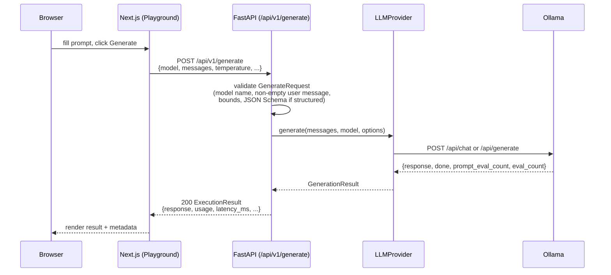
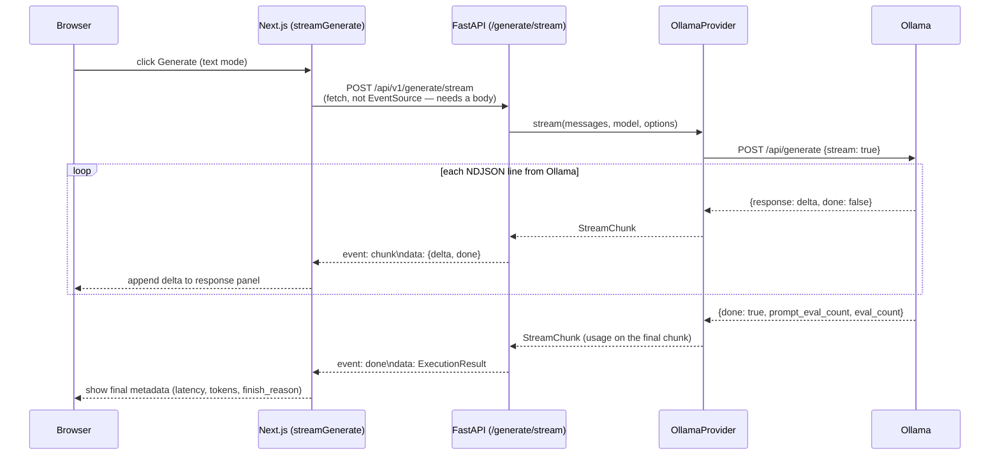

# LLM Execution (Phase 2)

How a prompt typed into the Playground turns into tokens on screen —
model discovery, the request/response schema, streaming, structured
output, and error handling. For the provider abstraction's shape and
rationale in general, see
[`architecture.md`](./architecture.md#llm-provider-abstraction); this
document is about the execution path specifically.

## Why the abstraction exists

The Playground, and everything built on top of it later (experiments,
evaluation, agents), needs to run prompts against *a* model without
caring which backend serves it. Ollama is the only backend today, but
nothing above `packages/llm` knows that — not the API routes, not the
frontend. Swapping in `OpenAIProvider` later means implementing
`LLMProvider` once and changing one factory function
(`app/llm/dependencies.py:get_llm_provider`); it doesn't mean touching
`/generate`, the Playground, or any future consumer.

## Request flow (non-streaming)



`GenerateRequest` (`apps/api/app/schemas/generation.py`) is
deliberately **not** shaped like Ollama's API — it's the stable,
provider-agnostic contract the frontend talks to.
`app/services/generation_service.py` is the only place that translates
between it and `packages/llm`'s types (`Message`, `GenerationOptions`).
If Ollama's wire format changes, or a second provider is added, this
schema doesn't move.

## Streaming architecture



**Why Server-Sent Events over `fetch`, not `EventSource`:** the
request needs a JSON body (model, messages, parameters) and
`EventSource` only supports `GET`. `src/lib/llm/stream.ts` reads the
response body as a stream, splits it on SSE frame boundaries
(`\n\n`), and yields typed events (`chunk` / `done` / `error`) that
`useGeneration()` folds into UI state.

**Cancellation:** the Stop button aborts the underlying `fetch` via
`AbortController`. Starlette detects the client disconnect and stops
iterating `OllamaProvider.stream()`'s async generator; no explicit
"cancel" plumbing was needed beyond passing the `AbortSignal` through.
Partial text already rendered is kept — the UI moves to a distinct
`cancelled` state rather than discarding it.

**Structured output is not streamed.** Ollama's `format` constraint
produces one JSON object; there's no meaningful way to render a
partially-valid JSON document incrementally, so `/generate/stream`
rejects requests with `response_schema` set (400) and the Playground
always uses the non-streaming endpoint in structured mode.

## Structured output

The Playground lets you define a JSON Schema and get validated JSON
back instead of free text:

1. Frontend validates the schema is well-formed JSON client-side
   before allowing submit (`components/playground/schema-editor.tsx`).
2. `GenerateRequest.response_schema` is re-validated server-side as an
   actual JSON Schema (`jsonschema.Draft202012Validator.check_schema`)
   — a malformed schema is rejected with 422 before any request
   reaches Ollama.
3. `OllamaProvider.generate_structured()` sends the schema as Ollama's
   `format` parameter, then validates the model's output against the
   same schema with `jsonschema.validate()`.
4. On success: a plain, schema-conforming `dict` comes back as
   `ExecutionResult.structured_output`.
5. On failure (invalid JSON, or valid JSON that doesn't match the
   schema): `StructuredOutputError` carries the raw model text. The API
   returns 422 with `{"detail": ..., "raw_response": "..."}` — the
   Playground shows both the error and the raw output side by side, so
   a bad generation is visible and debuggable rather than silently
   dropped. **The output is never coerced or partially accepted.**

The same `generate_structured()` method also accepts a Pydantic model
type instead of a raw schema (returning a validated instance instead
of a `dict`) — that's the path the future evaluation engine will use
for typed LLM-as-judge output, without needing a second method.

## Error handling

| Failure | Where it's caught | Response |
|---|---|---|
| Ollama unreachable | `ProviderConnectionError` | 503, everywhere `LLMProvider` is called |
| Model not installed | `ModelNotFoundError` | 404 |
| Structured output invalid | `StructuredOutputError` | 422 + raw model output |
| Bad request (empty prompt, out-of-range params, malformed schema) | Pydantic validation on `GenerateRequest` | 422, before any provider call |
| Unexpected exception | catch-all handler | 500, generic message (no stack trace leaked) |

Provider errors are registered as FastAPI exception handlers
(`app/core/exceptions.py`) rather than caught per-route — every route
that calls the provider gets consistent error responses for free. The
one exception is `/generate/stream`: once an SSE response has started,
FastAPI's exception-handler machinery can no longer change the HTTP
status, so the streaming route catches provider errors itself and
emits an `error` SSE event instead.

`GET /api/v1/models/health` is the one endpoint that deliberately never
raises on a provider error — it's meant to be polled to answer "is
Ollama up?", so it always returns `200` with `{"available": false,
"error": "..."}` rather than a `503` that would make polling awkward.

## Ollama integration specifics

- Chat-style prompts (`list[Message]`) use `/api/chat`; a plain string
  prompt uses `/api/generate` — both normalize to the same
  `LLMProvider` interface (see `OllamaProvider._build_request`).
- `GET /api/v1/models` maps Ollama's `/api/tags` to the
  provider-agnostic `ModelSummary` type. It deliberately does **not**
  make a per-model `/api/show` call to fill in `capabilities` — that
  would be an N+1 request pattern for a list endpoint — so
  `capabilities` is currently always `null` for Ollama. Left as `null`
  rather than guessed, per the "don't invent data the provider doesn't
  give you" rule that also applies to token counts.
- Token usage (`prompt_eval_count` / `eval_count` in Ollama's
  response) is only known once generation finishes. For streaming,
  Ollama reports it on the final NDJSON line — `StreamChunk` carries
  optional usage fields specifically so that final chunk isn't
  discarded.

## Frontend architecture

```
src/lib/llm/
  types.ts            Mirrors the API schema (by hand — no codegen yet)
  client.ts            GET /models, GET /models/health, POST /generate
  stream.ts             SSE reader for POST /generate/stream
  use-generation.ts     The Playground's state machine (idle/generating/done/error/cancelled)
  history.ts            localStorage-backed execution history
  token-estimate.ts     ~4 chars/token heuristic (not a real tokenizer)
src/components/playground/
  model-select.tsx, prompt-editor.tsx, parameters-panel.tsx,
  schema-editor.tsx, response-panel.tsx, execution-history.tsx
```

`useGeneration()` is the one place that decides streaming vs.
non-streaming based on whether `response_schema` is set, so
`app/playground/page.tsx` just calls `generate(request)` without
needing to know which transport is used.

## Security notes specific to this phase

- `GenerateRequest.model` is validated against an allow-list pattern
  (`^[A-Za-z0-9][A-Za-z0-9._:/-]*$`) before it ever reaches Ollama.
- The Ollama base URL is server-side configuration
  (`OLLAMA_BASE_URL`/`OLLAMA_BASE_URL_DOCKER`) — there is no
  request field that lets a client point the server at an arbitrary
  URL (no SSRF surface here).
- Model output is always rendered as text content (`<pre>{text}</pre>`
  in React, which escapes by default) — never through
  `dangerouslySetInnerHTML`. This matters more once tool/MCP output
  can contain arbitrary content.

## Future provider support

Adding `OpenAIProvider`/`AnthropicProvider`/`HuggingFaceProvider`
touches exactly two things: a new class in `packages/llm` implementing
`LLMProvider`, and `get_llm_provider()` in `app/llm/dependencies.py`
(likely becoming settings-driven — "which provider for which model" —
once there's more than one). Everything from `GenerateRequest` through
the Playground UI is already provider-agnostic and shouldn't need to
change.
